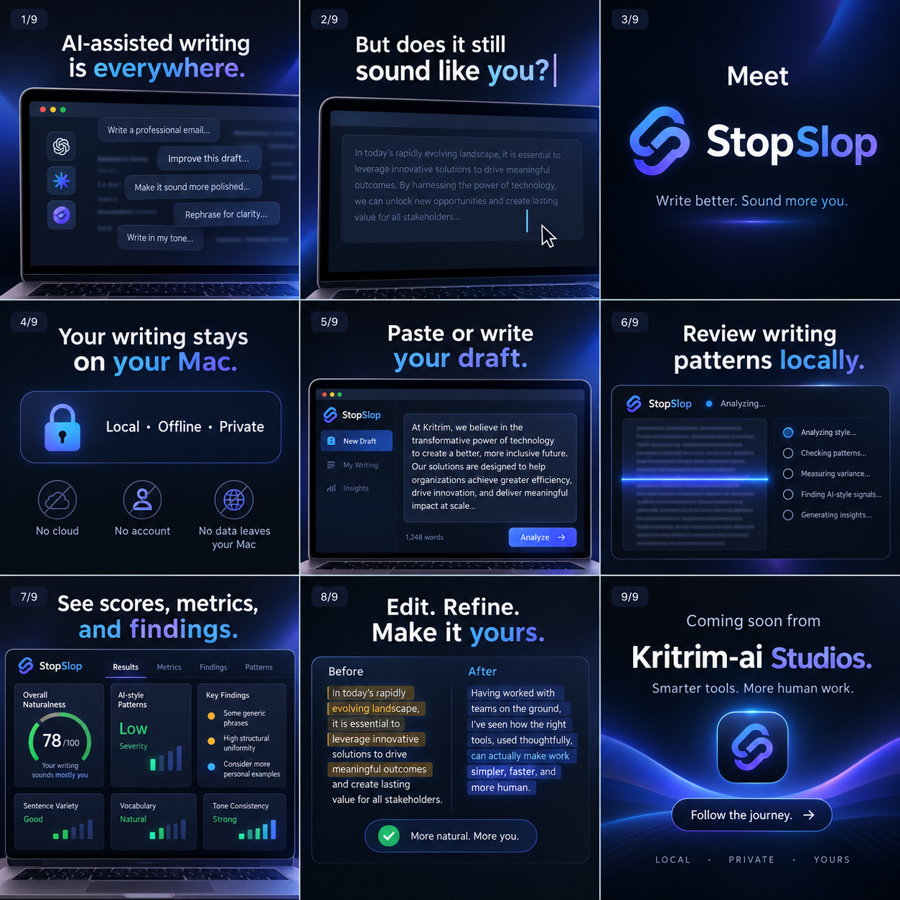

# StopSlop

<p align="center">
  <a href="https://www.kritrim-ai.com/">
    
  </a>
</p>

<p align="center"><strong>StopSlop by Kritrim-ai</strong><br />Local writing-pattern review for macOS</p>

<p align="center">
  
</p>

**StopSlop** is a privacy-first writing-pattern review application for macOS. It runs locally on the user’s Mac, analyzes prose without sending text to a server, and presents a score, severity band, metrics, and named writing-pattern findings.

StopSlop builds on [Sloptrim](https://github.com/seyedehsanhadi/sloptrim), a local detector for AI-writing patterns. StopSlop adds a polished desktop interface, local application packaging, accessibility-minded result presentation, and a downloadable macOS DMG.

> StopSlop reviews writing signals. It does not identify an author, prove AI use, or support academic, employment, legal, disciplinary, or other high-stakes decisions.

## Product status

**Version 2.0 is the end-user release target:** a ready-made Apple Silicon macOS `.dmg` published under GitHub Releases. The repository currently contains the product specification, desktop implementation, local analyzer sidecar build path, and DMG packaging configuration. The release artifact will require no cloud account, hosted API, database, or network connection for core analysis.

The Version 2.0 DMG is available from the [latest GitHub Release](https://github.com/MrinalGitHub/StopSlop/releases/tag/v2.0.0).

| Property | Version 2.0 target |
|---|---|
| Product type | Native-feeling local macOS desktop application |
| Distribution | Downloadable `.dmg` from GitHub Releases |
| Primary architecture | Tauri interface with a bundled local detector sidecar |
| Supported hardware | Apple Silicon Macs first |
| Analysis mode | Offline by default |
| Data retention | Raw submitted text is not intentionally persisted |
| Cloud dependency | None |
| Accounts | None |
| Upstream engine | Pinned and attributed Sloptrim source |

## Installation

The intended normal-user installation flow is:

1. Download the latest **StopSlop `.dmg`** from the [GitHub Releases page](https://github.com/MrinalGitHub/StopSlop/releases).
2. Open the DMG and drag StopSlop into the Applications folder.
3. Launch StopSlop from Applications.
4. Paste prose and choose **Analyse writing**.

The Version 2.0 release includes the Apple Silicon DMG, supported macOS architecture, checksum, release notes, and installation guidance. Developers can reproduce the build locally by following [`docs/release.md`](docs/release.md).

The product preview above illustrates the intended StopSlop experience: local, private writing review with a clear score, metrics, findings, and revision-oriented workflow.

## Planned user flow

1. The user opens StopSlop from the Applications folder.
2. The user pastes or types prose into the editor.
3. StopSlop displays the local word count and enables analysis when the minimum input length is met.
4. The bundled detector runs locally and returns a normalized result.
5. The interface presents the score, severity band, metrics, and findings in plain language.
6. The user can clear the draft and result at any time.

## Privacy model

StopSlop is designed so that analysis does not require an internet connection. The application must not send raw prose to a remote endpoint, log submitted text, store drafts in a database, or include raw text in telemetry. The implementation must preserve this behavior in development, packaged builds, crash handling, and documentation.

## Repository layout

```text
StopSlop/
├── app/                         # Tauri desktop application, added during implementation
├── assets/                      # Application icons, logo variants, and release artwork
├── docs/                        # Product, architecture, privacy, and release specifications
├── src/stopslop_engine/         # Local adapter and normalized analysis contract
├── tests/                       # Contract, adapter, and packaging tests
├── vendor/sloptrim/             # Pinned upstream source or release snapshot
├── .github/workflows/           # Continuous integration and release workflows
├── LICENSE                      # StopSlop project licence
├── NOTICE                       # Upstream and third-party notices
├── THIRD_PARTY_NOTICES.md       # Dependency and attribution record
├── pyproject.toml               # Local adapter tooling
└── README.md
```

## Development documentation

The detailed specification is in [`docs/StopSlop_Technical_Specification.md`](docs/StopSlop_Technical_Specification.md). The implementation decisions are described in [`docs/architecture.md`](docs/architecture.md), while privacy requirements are defined in [`docs/privacy.md`](docs/privacy.md).

## Attribution

> **Detection engine credit:** StopSlop builds on Sloptrim by Seyed Ehsan Hadi, licensed under Apache License 2.0. StopSlop adds the user interface, local adapter, packaging, and distribution configuration. The upstream author does not endorse StopSlop.

Applicable upstream licence, notice, and citation materials must remain in this repository and in release artifacts. See [`THIRD_PARTY_NOTICES.md`](THIRD_PARTY_NOTICES.md).

## Brand

The application uses Kritrim-ai branding with permission from the project owner. The public brand reference is [Kritrim-ai](https://www.kritrim-ai.com/). The transparent Kritrim-ai mark should be placed in the application About view and in other appropriate product surfaces without reducing readability or suggesting upstream endorsement.

## Contributing

Contributions are welcome after the local contract and privacy requirements are understood. Please read [`CONTRIBUTING.md`](CONTRIBUTING.md) before opening a pull request. Changes that introduce network access, raw-text persistence, opaque telemetry, or unsupported authorship claims are out of scope for the first release.

## Licence

StopSlop project code is intended to be released under Apache License 2.0 unless the repository owner selects another compatible open-source licence before the first public release. Upstream Sloptrim materials remain subject to their original licence and notices.

## References

[1]: https://github.com/seyedehsanhadi/sloptrim "Sloptrim upstream repository"

[2]: https://www.kritrim-ai.com/ "Kritrim-ai public website"
